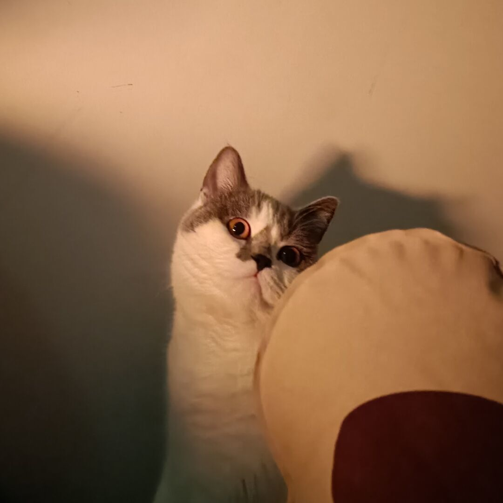

## Hello there 👋

- This is a college student's github profile.
- 🔭 Currently I'm looking for some interesting projects on github, and wanna contribute to the community.
- 😄 Let me know if you have any awesome project that fits newbie.

  - (As you can see, my English sucks)

<!--
**Try2079/Try2079** is a ✨ _special_ ✨ repository because its `README.md` (this file) appears on your GitHub profile.

Here are some ideas to get you started:

- 🔭 I’m currently working on ...
- 🌱 I’m currently learning ...
- 👯 I’m looking to collaborate on ...
- 🤔 I’m looking for help with ...
- 💬 Ask me about ...
- 📫 How to reach me: ...
- 😄 Pronouns: ...
- ⚡ Fun fact: ...
-->
